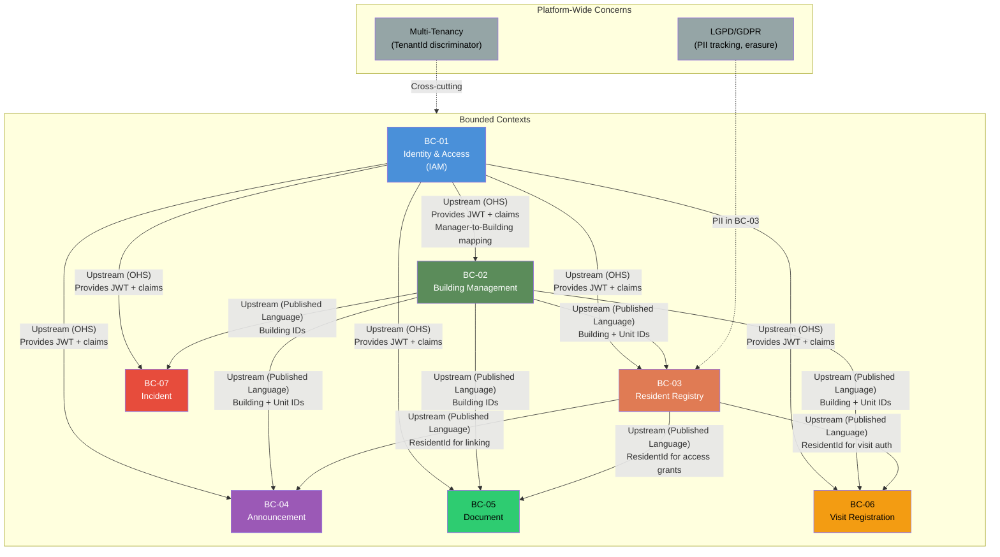

# Building Management Platform — Domain Model

**Version:** 1.0
**Date:** 2026-02-23
**Status:** Authoritative — approved for handoff
**Scope:** MVP (Phase 1 — Manager-only API)
**Compliance:** LGPD / GDPR

---

## Table of Contents

1. [Ubiquitous Language Glossary](#1-ubiquitous-language-glossary)
2. [Bounded Contexts](#2-bounded-contexts)
3. [Context Map](#3-context-map)
4. [Aggregates, Entities & Value Objects](#4-aggregates-entities--value-objects)
5. [Commands](#5-commands)
6. [Domain Events](#6-domain-events)
7. [Core Workflows](#7-core-workflows)
8. [Cross-Cutting Concerns](#8-cross-cutting-concerns)
9. [Suggested Seams & Consistency Requirements](#9-suggested-seams--consistency-requirements)
10. [Next Actions](#10-next-actions)
11. [Handoff Notes](#11-handoff-notes)

---

## 1. Ubiquitous Language Glossary

> These terms are canonical. Avoid the listed aliases in code, APIs, documentation, and conversation.

| Term | Definition | Context | Aliases — AVOID |
|---|---|---|---|
| **Tenant** | A property management company that subscribes to the platform. All data is scoped to a Tenant. | Platform-wide | "client", "organization", "company" |
| **Building** | A physical property (apartment complex, office building, condominium) managed by a Tenant. The top-level domain object for operations. "Community" is a synonym for Building — do NOT use "Community" as a sub-group. | Building Management | "Community" (synonym, not sub-level), "Property", "Complex" |
| **Unit** | A discrete occupiable space within a Building (e.g., apartment 301, office suite B). | Building Management | "Apartment", "Suite", "Room" |
| **Resident** | A person assigned to a Unit. Has a role of either Owner or Renter. In Phase 1, residents do not access the API directly. | Resident Registry | "Tenant" (avoid — conflicts with Tenant the SaaS customer), "Occupant", "User" (only managers are Users in MVP) |
| **Owner** | A Resident role indicating the person holds legal ownership of the Unit. An Owner may simultaneously rent out their unit. | Resident Registry | "Proprietor" |
| **Renter** | A Resident role indicating the person occupies the Unit under a lease or rental agreement. | Resident Registry | "Tenant" (avoid — conflicts), "Leaseholder" |
| **Manager** | A platform User who belongs to a Tenant and manages one or more Buildings. Managers are the only API actors in Phase 1. | Identity & Access | "Admin" (avoid generality), "BuildingAdmin" |
| **Announcement** | A message published by a Manager to communicate with residents or other stakeholders. Has a lifecycle: Draft → Published → Archived. | Announcement | "Notice", "Post", "Message" |
| **Audience** | The set of recipients targeted by an Announcement. Defined by scope: Building-wide, Unit-level, or Individual Resident. | Announcement | "Recipients", "Targets" |
| **Document** | A file uploaded by a Manager for sharing. Access is granted explicitly by the Manager to Buildings or individual Residents. | Document | "File", "Attachment" |
| **Document Access Grant** | An explicit record of permission for a Building or Resident to access a Document. Can be revoked. | Document | "Permission", "Share" |
| **Visit** | A recorded event of a visitor arriving at a Building. Linked to a Unit and an authorizing Resident. | Visit | "Guest", "Entry" |
| **Visitor** | A non-resident person arriving at a Building. NOT a platform user. Identified by name and document. | Visit | "Guest", "Non-resident" |
| **Incident** | A reported problem or event requiring attention within a Building. Has a lifecycle: Open → InProgress → Resolved. | Incident | "Issue", "Ticket", "Report" |
| **Incident Type** | Classification of an incident (e.g., Maintenance, Security, Infrastructure, Noise). | Incident | "Category" |
| **Incident Severity** | Urgency classification of an incident (e.g., Low, Medium, High, Critical). | Incident | "Priority" |
| **Move-In** | The act of registering a Resident as actively occupying a Unit. | Resident Registry | "Assignment", "Registration" |
| **Move-Out** | The act of marking a Resident as no longer occupying a Unit. Triggers data retention review for LGPD compliance. | Resident Registry | "Deregistration", "Removal" |
| **Personal Data** | Any data field that identifies or can identify a natural person. Subject to LGPD right-to-erasure. Marked in aggregate definitions. | Platform-wide | — |
| **Soft Delete** | Marking a record as logically removed without physical deletion. Used for audit history preservation. Physical deletion is deferred to LGPD erasure workflows. | Platform-wide | "Archive" (different lifecycle stage for Announcements) |
| **TenantId** | A discriminator value present on all aggregate roots, ensuring data isolation across Tenants. | Platform-wide | "OrganizationId", "CompanyId" |

---

## 2. Bounded Contexts

### BC-01: Identity & Access (IAM)

**Responsibility:** Authentication, authorization, JWT issuance, role management, Tenant provisioning.
**Owns:** Manager users, their roles, their assigned Buildings, Tenant lifecycle.
**Phase 1 scope:** Manager role only. Owner/Renter roles are modeled but have no API login in MVP.
**Key invariant:** A Manager can only access Buildings that belong to their Tenant.

### BC-02: Building Management

**Responsibility:** Building and Unit registry — the physical hierarchy that all other contexts reference.
**Owns:** Building aggregate, Unit aggregate.
**Key invariant:** Unit identifiers are unique within a Building; Building identifiers are unique within a Tenant.
**Note:** This context is the upstream reference for all other contexts. They conform to Building/Unit IDs defined here.

### BC-03: Resident Registry

**Responsibility:** Registering residents (Owners and Renters), linking them to Units, tracking occupancy history, LGPD data management.
**Owns:** Resident aggregate, occupancy records.
**Key invariant:** A Unit may have at most one Owner and one active Renter at the same time. A Resident must always be linked to a valid Unit in the same Tenant.
**LGPD:** This context owns all PII fields — CPF/document number, full name, email, phone. It provides the erasure endpoint.

### BC-04: Announcement

**Responsibility:** Creating, targeting, publishing, and archiving announcements to residents.
**Owns:** Announcement aggregate, AudienceSpecification value object.
**Key invariant:** An Announcement can only be Published from Draft state. A Published announcement cannot return to Draft. Audience must be non-empty at publish time.

### BC-05: Document

**Responsibility:** Uploading documents, managing access grants per Building or Resident, revoking access.
**Owns:** Document aggregate, DocumentAccessGrant entity.
**Key invariant:** A Document belongs to exactly one Tenant. Access may be granted to Buildings or individual Residents within that Tenant. File storage is abstracted — the domain holds only a StorageReference value object.

### BC-06: Visit Registration

**Responsibility:** Logging visitor arrivals and departures, linking visits to Units and authorizing Residents.
**Owns:** Visit aggregate.
**Key invariant:** A Visit must reference a valid Building, Unit, and a Resident who is active in that Unit at registration time. CheckOut cannot precede CheckIn.

### BC-07: Incident

**Responsibility:** Reporting and tracking incidents within Buildings through their lifecycle.
**Owns:** Incident aggregate.
**Key invariant:** An Incident must always belong to a Building within the same Tenant. Status transitions are strictly enforced: Open → InProgress → Resolved. Resolved incidents may not be re-opened (create a new Incident instead).

---

## 3. Context Map



**Relationship legend:**

| Relationship Type | Description |
|---|---|
| OHS (Open Host Service) | IAM exposes a well-defined JWT + claims contract. Downstream contexts validate tokens without calling back to IAM at request time. |
| Published Language | Building Management publishes Building/Unit IDs as canonical references. All downstream contexts are Conformist — they use these IDs as foreign keys and do NOT translate them. |
| ACL (Anti-Corruption Layer) | None required in MVP — all contexts share the same deployment and team. Introduce if contexts become separate microservices. |

---

## 4. Aggregates, Entities & Value Objects

### Legend
- **AR** = Aggregate Root
- **E** = Entity (has identity, not an AR)
- **VO** = Value Object (no identity, equality by value)
- `[PII]` = Contains personal data subject to LGPD right-to-erasure

---

### BC-01: Identity & Access

| Type | Name | Key Invariants | Fields / Notes |
|---|---|---|---|
| AR | **Tenant** | Name must be unique on the platform; Status must be Active to allow logins | TenantId, Name, Status (Active/Suspended), CreatedAt |
| AR | **Manager** | Email must be unique within a Tenant; must belong to exactly one Tenant; must have at least one role | ManagerId, TenantId, Email `[PII]`, FullName `[PII]`, HashedPassword, Roles (set of ManagerRole), AssignedBuildingIds (set), CreatedAt, DeletedAt (soft-delete) |
| VO | **ManagerRole** | Value is one of {SuperAdmin, BuildingManager} | RoleValue |
| VO | **AssignedBuildings** | Set of BuildingIds; empty set = access to no buildings (invalid for BuildingManager role) | BuildingId[] |

---

### BC-02: Building Management

| Type | Name | Key Invariants | Fields / Notes |
|---|---|---|---|
| AR | **Building** | Name must be non-empty; must belong to a Tenant; DeletedAt null means active | BuildingId, TenantId, Name, Address (VO), TotalFloors, CreatedAt, DeletedAt (soft-delete) |
| E | **Unit** | UnitNumber must be unique within a Building; a Unit cannot be deleted if it has active Residents | UnitId, BuildingId, TenantId, UnitNumber, Floor, Type (VO), CreatedAt, DeletedAt (soft-delete) |
| VO | **Address** | Street, Number, Complement, Neighborhood, City, State, PostalCode, Country — all non-empty except Complement | — |
| VO | **UnitType** | One of {Residential, Commercial, Parking, Storage} | TypeValue |

**Note:** Unit is modeled as a child Entity of Building but persisted as a first-class row (with BuildingId FK). Its aggregate root for command purposes is Building (AddUnit command targets Building AR). For queries, Unit is queryable independently.

---

### BC-03: Resident Registry

| Type | Name | Key Invariants | Fields / Notes |
|---|---|---|---|
| AR | **Resident** | Must be linked to exactly one active Unit within the same Tenant; Role must be Owner or Renter; a Unit may have at most one Owner; a Unit may have one active Renter; Email must be unique within a Tenant | ResidentId, TenantId, BuildingId, UnitId, FullName `[PII]`, Email `[PII]`, Phone `[PII]`, DocumentNumber `[PII]` (CPF or equivalent), Role (VO), Status (VO), InviteToken (nullable), MoveInDate, MoveOutDate (nullable), CreatedAt, DeletedAt (soft-delete) |
| VO | **ResidentRole** | One of {Owner, Renter} | RoleValue |
| VO | **ResidentStatus** | One of {Invited, Active, MovedOut} — transitions: Invited → Active (on first login or manager activation), Active → MovedOut | StatusValue |
| VO | **OccupancyPeriod** | MoveInDate + MoveOutDate (nullable). MoveOutDate must be >= MoveInDate if set. | — |

**LGPD Notes:**
- Fields marked `[PII]` must be pseudonymized or deleted upon a valid right-to-erasure request.
- MoveOutDate triggers a 30-day data retention window (⚠️ HYPOTHESIS — validate retention period with legal team).
- DeletedAt soft-delete preserves audit trail; a separate LGPD erasure job nullifies PII fields after the retention window.
- InviteToken must be treated as sensitive; it should expire after 72 hours (⚠️ HYPOTHESIS — validate with product team).

---

### BC-04: Announcement

| Type | Name | Key Invariants | Fields / Notes |
|---|---|---|---|
| AR | **Announcement** | Must belong to a Tenant; Title and Body must be non-empty at publish time (drafts may have empty body); AudienceSpecification must resolve to a non-empty audience at publish time; lifecycle is strictly Draft → Published → Archived | AnnouncementId, TenantId, AuthoredByManagerId, Title, Body, Status (VO), AudienceSpecification (VO), PublishedAt (nullable), ArchivedAt (nullable), CreatedAt, DeletedAt (soft-delete) |
| VO | **AnnouncementStatus** | One of {Draft, Published, Archived}. Allowed transitions: Draft → Published, Published → Archived. No other transitions. | StatusValue |
| VO | **AudienceSpecification** | Defines the target audience. Scope is one of {BuildingWide, UnitLevel, Individual}. Contains BuildingId (always required), UnitIds (required if scope = UnitLevel or Individual), ResidentIds (required if scope = Individual). Invariant: if scope = BuildingWide then UnitIds and ResidentIds must be empty; if scope = UnitLevel then UnitIds non-empty and ResidentIds empty; if scope = Individual then ResidentIds non-empty. | Scope, BuildingId, UnitIds[], ResidentIds[] |

**Audience resolution is deterministic:** given an AudienceSpecification, the set of Residents receiving the announcement can always be computed by querying Resident Registry for active residents matching the scope. This makes the targeting testable without side effects.

---

### BC-05: Document

| Type | Name | Key Invariants | Fields / Notes |
|---|---|---|---|
| AR | **Document** | Must belong to a Tenant; OriginalFileName non-empty; StorageReference must be set before sharing; a Document may have zero or more AccessGrants; revoking a non-existent grant is a no-op (idempotent) | DocumentId, TenantId, UploadedByManagerId, OriginalFileName, ContentType, FileSizeBytes, StorageReference (VO), Status (VO), CreatedAt, DeletedAt (soft-delete) |
| E | **DocumentAccessGrant** | GranteeType must be Building or Resident; GranteeId must reference a valid Building or Resident within the same Tenant; a Grant is unique per (DocumentId, GranteeType, GranteeId) | GrantId, DocumentId, TenantId, GranteeType (VO), GranteeId, GrantedByManagerId, GrantedAt, RevokedAt (nullable) |
| VO | **StorageReference** | Abstracts the file storage backend. Contains StorageProvider (Local or AzureBlob), StoragePath (opaque string). The domain never interprets the path — the storage service does. | StorageProvider, StoragePath |
| VO | **DocumentStatus** | One of {Uploaded, Shared, Revoked}. Uploaded = no active grants. Shared = at least one active grant. Revoked = all grants revoked. Status is derived, not stored. | — |
| VO | **GranteeType** | One of {Building, Resident} | TypeValue |

---

### BC-06: Visit Registration

| Type | Name | Key Invariants | Fields / Notes |
|---|---|---|---|
| AR | **Visit** | Must reference a valid Building, Unit, and Resident (all within same Tenant) at registration time; CheckOutAt must be null or >= CheckInAt; a Visit cannot be checked out before it is checked in; Visitor name must be non-empty | VisitId, TenantId, BuildingId, UnitId, AuthorizingResidentId, Visitor (VO), Status (VO), RegisteredByManagerId, RegisteredAt, CheckInAt (nullable), CheckOutAt (nullable), CreatedAt |
| VO | **Visitor** | Identifies the non-resident person. FullName `[PII]` non-empty; DocumentNumber `[PII]` (optional); VehiclePlate (optional) | FullName, DocumentNumber, VehiclePlate |
| VO | **VisitStatus** | One of {Registered, CheckedIn, CheckedOut}. Transitions: Registered → CheckedIn → CheckedOut. | StatusValue |

**LGPD Note:** Visitor.FullName and Visitor.DocumentNumber are PII. Apply the same pseudonymization approach as Resident Registry after the applicable retention period.

---

### BC-07: Incident

| Type | Name | Key Invariants | Fields / Notes |
|---|---|---|---|
| AR | **Incident** | Must reference a valid Building within same Tenant; Title and Description non-empty; Type and Severity must be valid enumerated values; Status transitions are strictly Open → InProgress → Resolved; Resolved incidents are immutable (create a new Incident to reopen) | IncidentId, TenantId, BuildingId, UnitId (nullable — incident may be common area), ReportedByManagerId, Title, Description, Type (VO), Severity (VO), Status (VO), Location (VO), OpenedAt, InProgressAt (nullable), ResolvedAt (nullable), ResolutionNotes (nullable), CreatedAt, DeletedAt (soft-delete) |
| VO | **IncidentType** | One of {Maintenance, Security, Infrastructure, Noise, Other} | TypeValue |
| VO | **IncidentSeverity** | One of {Low, Medium, High, Critical} | SeverityValue |
| VO | **IncidentStatus** | One of {Open, InProgress, Resolved}. Transitions: Open → InProgress, Open → Resolved (direct close), InProgress → Resolved. No backward transitions. | StatusValue |
| VO | **IncidentLocation** | Free-text description of where in the building the incident occurred. Non-empty. May reference a UnitId. | Description, UnitId (nullable) |

---

## 5. Commands

> Commands express intent. They are validated before being applied to an aggregate. All commands carry TenantId (from JWT claims) and IssuedByManagerId implicitly.

### BC-01: Identity & Access

| Command | Intent | Key Validations | Target Aggregate |
|---|---|---|---|
| `ProvisionTenant` | Create a new Tenant account on the platform | Name non-empty, Name globally unique | Tenant |
| `CreateManager` | Register a new Manager under a Tenant | Email unique within Tenant, Role valid | Manager |
| `AssignBuildingToManager` | Grant a Manager access to a Building | Building must belong to same Tenant | Manager |
| `RevokeBuildingFromManager` | Remove a Manager's access to a Building | Building must have been assigned | Manager |
| `DeactivateManager` | Soft-delete a Manager account | Manager must be Active | Manager |

### BC-02: Building Management

| Command | Intent | Key Validations | Target Aggregate |
|---|---|---|---|
| `CreateBuilding` | Register a new Building under a Tenant | Name non-empty, Address complete, TotalFloors >= 1 | Building |
| `UpdateBuilding` | Edit Building metadata | Building must exist and be active | Building |
| `AddUnit` | Add a Unit to a Building | UnitNumber unique within Building, Floor <= TotalFloors, Type valid | Building (Unit child) |
| `UpdateUnit` | Edit Unit metadata | Unit must exist and be active | Building (Unit child) |
| `DeactivateBuilding` | Soft-delete a Building | Must have no active Units (or force-cascade, TBD) | Building |

**Ambiguity A1 — Cascade deactivation of Units when a Building is deactivated:**
| Option | Pros | Cons |
|---|---|---|
| Block deactivation if active Units exist | Simple, safe, prevents orphaned data | Requires manager to manually deactivate all units first |
| Cascade soft-delete to Units and Residents | Single manager action | Complex, harder to audit, may surprise managers |
| Soft-delete Building only, orphan Units | Simple implementation | Leaves data in inconsistent state |

**Recommendation:** Option 1 (block) — ⚠️ HYPOTHESIS — validate with product team.

### BC-03: Resident Registry

| Command | Intent | Key Validations | Target Aggregate |
|---|---|---|---|
| `RegisterResident` | Create a Resident record for an Owner or Renter | Unit must be active and belong to same Tenant; Role Owner: Unit has no other active Owner; Role Renter: Unit has no other active Renter; Email unique within Tenant | Resident |
| `InviteResident` | Generate and send an invite token to a Resident | Resident must be in Registered or Invited status; Email valid | Resident |
| `ActivateResident` | Mark Resident as Active (token redeemed or manager override) | Resident must be in Invited status | Resident |
| `UpdateResidentInfo` | Update non-identifying contact info | Resident must be Active | Resident |
| `MoveOutResident` | Mark Resident as MovedOut, set MoveOutDate | Resident must be Active; MoveOutDate >= MoveInDate | Resident |

### BC-04: Announcement

| Command | Intent | Key Validations | Target Aggregate |
|---|---|---|---|
| `CreateAnnouncement` | Create a new Announcement in Draft state | Title non-empty; AudienceSpecification valid for its scope; Building within Manager's assigned buildings | Announcement |
| `UpdateAnnouncement` | Edit a Draft Announcement | Announcement must be in Draft status | Announcement |
| `PublishAnnouncement` | Transition Announcement from Draft → Published | Title and Body non-empty; AudienceSpecification resolves to non-empty audience; Announcement in Draft status | Announcement |
| `ArchiveAnnouncement` | Transition Announcement from Published → Archived | Announcement must be in Published status | Announcement |
| `DeleteDraftAnnouncement` | Soft-delete a Draft Announcement | Announcement must be in Draft status | Announcement |

### BC-05: Document

| Command | Intent | Key Validations | Target Aggregate |
|---|---|---|---|
| `UploadDocument` | Register a Document with a StorageReference after file is saved | OriginalFileName non-empty; StorageReference non-null; ContentType valid; FileSizeBytes > 0 | Document |
| `ShareDocument` | Grant access to a Building or Resident | Grantee must exist within same Tenant; Grant must not already be active (idempotent if already granted) | Document |
| `RevokeDocumentAccess` | Revoke an active Access Grant | Grant must exist; idempotent if already revoked | Document |
| `DeleteDocument` | Soft-delete a Document | Document must have no active grants OR manager confirms revoke-all | Document |

### BC-06: Visit Registration

| Command | Intent | Key Validations | Target Aggregate |
|---|---|---|---|
| `RegisterVisit` | Log a planned or arrived visitor | Building, Unit, AuthorizingResident must be valid and active within same Tenant; Visitor.FullName non-empty | Visit |
| `CheckInVisitor` | Record visitor physical arrival | Visit must be in Registered status | Visit |
| `CheckOutVisitor` | Record visitor departure | Visit must be in CheckedIn status; CheckOutAt >= CheckInAt | Visit |

### BC-07: Incident

| Command | Intent | Key Validations | Target Aggregate |
|---|---|---|---|
| `ReportIncident` | Open a new Incident | Building must be active and within same Tenant; Title and Description non-empty; Type and Severity valid | Incident |
| `UpdateIncidentStatus` | Advance Incident through lifecycle | Transition must be valid (Open→InProgress or Open→Resolved or InProgress→Resolved) | Incident |
| `AddResolutionNotes` | Attach notes to a Resolved Incident | Incident must be Resolved | Incident |
| `CloseIncident` | Alias for UpdateIncidentStatus → Resolved with ResolutionNotes | Same as UpdateIncidentStatus | Incident |

---

## 6. Domain Events

> Events record facts that have already occurred. They are immutable. All events carry TenantId, OccurredAt, and CorrelationId.

### BC-01: Identity & Access

| Event | Meaning | Producer | Consumer(s) | Key Payload Fields |
|---|---|---|---|---|
| `TenantProvisioned` | A new Tenant has been created | IAM | — | TenantId, Name, OccurredAt |
| `ManagerCreated` | A new Manager account was created | IAM | — | ManagerId, TenantId, Email, OccurredAt |
| `BuildingAssignedToManager` | A Manager was granted access to a Building | IAM | Building Management (informational) | ManagerId, TenantId, BuildingId, OccurredAt |

### BC-02: Building Management

| Event | Meaning | Producer | Consumer(s) | Key Payload Fields |
|---|---|---|---|---|
| `BuildingCreated` | A Building has been registered | Building Management | IAM (for manager assignment), Incident (reference validation) | BuildingId, TenantId, Name, Address, OccurredAt |
| `UnitAdded` | A Unit has been added to a Building | Building Management | Resident Registry (reference validation) | UnitId, BuildingId, TenantId, UnitNumber, Floor, Type, OccurredAt |
| `BuildingDeactivated` | A Building has been soft-deleted | Building Management | All downstream contexts (for reference cleanup) | BuildingId, TenantId, OccurredAt |

### BC-03: Resident Registry

| Event | Meaning | Producer | Consumer(s) | Key Payload Fields |
|---|---|---|---|---|
| `ResidentRegistered` | A new Resident has been created | Resident Registry | Announcement (for audience resolution), Visit (for authorization) | ResidentId, TenantId, BuildingId, UnitId, Role, OccurredAt |
| `ResidentInvited` | An invite token was generated and dispatched | Resident Registry | (Notification service — future) | ResidentId, TenantId, InviteTokenExpiry, OccurredAt |
| `ResidentActivated` | A Resident transitioned to Active status | Resident Registry | — | ResidentId, TenantId, OccurredAt |
| `ResidentMovedOut` | A Resident's occupancy has ended | Resident Registry | LGPD Retention Job (start retention clock), Visit (close open visits) | ResidentId, TenantId, UnitId, MoveOutDate, OccurredAt |
| `ResidentPIIErased` | PII fields for a Resident have been pseudonymized | Resident Registry | Audit / Compliance | ResidentId, TenantId, ErasedFields[], OccurredAt |

### BC-04: Announcement

| Event | Meaning | Producer | Consumer(s) | Key Payload Fields |
|---|---|---|---|---|
| `AnnouncementCreated` | A Draft Announcement was created | Announcement | — | AnnouncementId, TenantId, AuthoredByManagerId, AudienceSpecification, OccurredAt |
| `AnnouncementPublished` | An Announcement moved to Published state | Announcement | (Notification service — future), Analytics | AnnouncementId, TenantId, AudienceSpecification, PublishedAt, OccurredAt |
| `AnnouncementArchived` | An Announcement moved to Archived state | Announcement | — | AnnouncementId, TenantId, ArchivedAt, OccurredAt |

### BC-05: Document

| Event | Meaning | Producer | Consumer(s) | Key Payload Fields |
|---|---|---|---|---|
| `DocumentUploaded` | A Document was registered with a StorageReference | Document | — | DocumentId, TenantId, OriginalFileName, StorageReference, OccurredAt |
| `DocumentShared` | An Access Grant was created | Document | (Notification service — future) | DocumentId, TenantId, GrantId, GranteeType, GranteeId, OccurredAt |
| `DocumentAccessRevoked` | An Access Grant was revoked | Document | — | DocumentId, TenantId, GrantId, GranteeType, GranteeId, RevokedAt, OccurredAt |

### BC-06: Visit Registration

| Event | Meaning | Producer | Consumer(s) | Key Payload Fields |
|---|---|---|---|---|
| `VisitRegistered` | A Visit was logged | Visit | — | VisitId, TenantId, BuildingId, UnitId, AuthorizingResidentId, OccurredAt |
| `VisitorCheckedIn` | A Visitor physically arrived | Visit | — | VisitId, TenantId, BuildingId, CheckInAt, OccurredAt |
| `VisitorCheckedOut` | A Visitor departed | Visit | LGPD Retention Job (visitor PII) | VisitId, TenantId, BuildingId, CheckOutAt, OccurredAt |

### BC-07: Incident

| Event | Meaning | Producer | Consumer(s) | Key Payload Fields |
|---|---|---|---|---|
| `IncidentReported` | A new Incident was opened | Incident | — | IncidentId, TenantId, BuildingId, UnitId, Type, Severity, OpenedAt, OccurredAt |
| `IncidentStatusUpdated` | An Incident's status changed | Incident | — | IncidentId, TenantId, PreviousStatus, NewStatus, UpdatedByManagerId, OccurredAt |
| `IncidentResolved` | An Incident reached Resolved status | Incident | Analytics | IncidentId, TenantId, BuildingId, ResolvedAt, ResolutionNotes, OccurredAt |

---

## 7. Core Workflows

### W-01: Resident Registration & Move-In

```
Manager                BC-02 Building Mgmt      BC-03 Resident Registry
  |                          |                          |
  |--[RegisterResident]----->|                          |
  |       (BuildingId,       |                          |
  |        UnitId check)     |                          |
  |<--[Unit valid/active]----|                          |
  |                          |                          |
  |--[RegisterResident]-------------------------------->|
  |                          |      (validate: Unit active, role constraints,
  |                          |       email unique within Tenant)
  |<--[ResidentId]------------------------------------- |
  |                          |       [ResidentRegistered event emitted]
  |                          |                          |
  |--[InviteResident]---------------------------------->|
  |                          |       (generate InviteToken, set expiry)
  |<--[OK]---------------------------------------------|
  |                          |       [ResidentInvited event emitted]
```

**Edge cases:**
- Unit already has an active Owner when registering another Owner → reject with domain error `UnitAlreadyHasOwner`.
- Unit already has an active Renter when registering another Renter → reject with domain error `UnitAlreadyHasRenter`.
- Email already registered as a Resident in this Tenant → reject with `ResidentEmailConflict`.
- Manager does not have access to the Building → rejected at IAM / authorization layer (not a domain error).

---

### W-02: Announcement Creation & Publishing

```
Manager             BC-04 Announcement           BC-03 Resident Registry (query)
  |                       |                              |
  |--[CreateAnnouncement]->|                              |
  |     (AudienceSpec,    |  (store as Draft)            |
  |      Title, Body)     |                              |
  |<--[AnnouncementId]----|  [AnnouncementCreated]       |
  |                       |                              |
  |--[PublishAnnouncement]>|                              |
  |                       |--[resolve audience]--------->|
  |                       |<--[ResidentIds (non-empty)]--|
  |                       |  (validate: non-empty)       |
  |                       |  (status: Draft → Published) |
  |                       |  [AnnouncementPublished]     |
  |<--[OK]----------------|                              |
```

**Edge cases:**
- AudienceSpecification resolves to zero active Residents (e.g., vacant unit) → reject with `EmptyAudienceError` at publish time, not at draft time.
- Announce to a Building that has no active Residents → same `EmptyAudienceError`.
- Manager tries to publish an already-Published announcement → reject with `InvalidStatusTransition`.
- Title empty at publish time → reject with `AnnouncementTitleRequired`.

---

### W-03: Document Upload & Sharing

```
Manager         File Storage Abstraction    BC-05 Document
  |                      |                      |
  |--[Upload file]------->|                      |
  |<--[StorageReference]--|                      |
  |                       |                      |
  |--[UploadDocument (StorageRef, meta)]-------->|
  |<--[DocumentId]--------------------------------|
  |                        [DocumentUploaded event]
  |                                              |
  |--[ShareDocument (GranteeType, GranteeId)]---->|
  |             (validate grantee within Tenant) |
  |<--[GrantId]-----------------------------------|
  |                        [DocumentShared event]
```

**Edge cases:**
- Share to a ResidentId that does not belong to the same Tenant → reject with `GranteeNotInTenant`.
- Share to a BuildingId not belonging to same Tenant → same error.
- Re-share an already-active grant → idempotent, return existing GrantId without creating duplicate.
- Revoke a grant that does not exist or is already revoked → idempotent no-op.

---

### W-04: Visit Check-In / Check-Out

```
Manager           BC-06 Visit Registration       BC-03 Resident Registry (validation)
  |                       |                              |
  |--[RegisterVisit]------>|                              |
  |   (BuildingId,         |--[validate Resident active]->|
  |    UnitId,             |<--[OK]----------------------|
  |    ResidentId,         |  (store: status=Registered)  |
  |    Visitor)            |  [VisitRegistered event]     |
  |<--[VisitId]------------|                              |
  |                        |                              |
  |--[CheckInVisitor]------>|                              |
  |   (VisitId)            |  (status: Registered → CheckedIn)
  |                        |  [VisitorCheckedIn event]    |
  |<--[OK]-----------------|                              |
  |                        |                              |
  |--[CheckOutVisitor]----->|                              |
  |   (VisitId)            |  (status: CheckedIn → CheckedOut)
  |                        |  [VisitorCheckedOut event]   |
  |<--[OK]-----------------|                              |
```

**Edge cases:**
- AuthorizingResident is MovedOut at visit registration time → reject with `ResidentNotActive`.
- CheckIn on an already CheckedIn visit → reject with `InvalidStatusTransition`.
- CheckOut with CheckOutAt < CheckInAt → reject with `InvalidCheckOutTime`.
- Building does not belong to Manager's Tenant → rejected at authorization layer.

---

### W-05: Incident Lifecycle

```
Manager                         BC-07 Incident
  |                                   |
  |--[ReportIncident]---------------->|
  |   (BuildingId, Type, Severity,    |  (status = Open)
  |    Title, Description)            |  [IncidentReported event]
  |<--[IncidentId]--------------------|
  |                                   |
  |--[UpdateIncidentStatus(InProgress)]>
  |                                   |  (Open → InProgress)
  |                                   |  [IncidentStatusUpdated event]
  |<--[OK]-----------------------------|
  |                                   |
  |--[CloseIncident(ResolutionNotes)]->|
  |                                   |  (InProgress → Resolved)
  |                                   |  [IncidentResolved event]
  |<--[OK]-----------------------------|
```

**Edge cases:**
- UpdateIncidentStatus with same status → reject with `InvalidStatusTransition`.
- Attempt to reopen a Resolved Incident → reject with `IncidentImmutableWhenResolved` (instruct manager to report a new incident).
- Incident references a UnitId that belongs to a different Building → reject with `UnitNotInBuilding`.

---

## 8. Cross-Cutting Concerns

### 8.1 Multi-Tenancy

- **TenantId is a discriminator on every aggregate root** and must be validated on every command before any domain logic runs.
- TenantId is extracted from the JWT claims — it is never accepted from the request body.
- All repository queries MUST include a TenantId filter at the infrastructure layer. This is enforced by convention and should be tested with integration tests per context.
- Row-level isolation strategy (one schema per tenant vs. shared schema with TenantId column) is an **infrastructure decision** deferred to the Solution Architect. The domain model is neutral.

### 8.2 LGPD / GDPR Compliance

**PII field inventory:**

| Context | Aggregate | PII Fields |
|---|---|---|
| IAM | Manager | Email, FullName |
| Resident Registry | Resident | FullName, Email, Phone, DocumentNumber |
| Visit | Visit | Visitor.FullName, Visitor.DocumentNumber |

**Erasure protocol:**
1. Right-to-erasure request arrives for a ResidentId or VisitorId.
2. System verifies there is no active legal hold (e.g., open Incident referencing the Resident — ⚠️ HYPOTHESIS — validate legal hold rules with legal team).
3. PII fields are replaced with a pseudonym token (e.g., `[ERASED-{hash}]`), preserving referential integrity for audit records.
4. `ResidentPIIErased` event is emitted for compliance log.
5. Physical deletion of the row is NOT performed — the soft-deleted record with pseudonymized data is retained for the audit trail.

**Data retention:**
- Resident PII: retained for 30 days after MoveOutDate (⚠️ HYPOTHESIS).
- Visitor PII: retained for 30 days after CheckOutAt (⚠️ HYPOTHESIS).
- Initiation of the retention clock is triggered by `ResidentMovedOut` and `VisitorCheckedOut` events.

### 8.3 Soft Delete Pattern

- All aggregates except Visit use soft delete (`DeletedAt` timestamp).
- Visit records are append-only and not soft-deleted (they are immutable log entries).
- A soft-deleted entity MUST NOT appear in any active-record query.
- Soft-deleted records ARE included in audit/history queries.
- The physical row is never deleted by application code. Deletion, if ever required, goes through the LGPD erasure workflow.

### 8.4 Audit Trail

- Every aggregate mutation records `CreatedAt`, `UpdatedAt`, and the responsible `ManagerId`.
- Domain events serve as the primary audit log. They must be persisted to an event store or outbox table (infrastructure decision).
- The Outbox Pattern is recommended to guarantee at-least-once delivery of events without distributed transactions (⚠️ HYPOTHESIS — confirm with architect).

---

## 9. Suggested Seams & Consistency Requirements

### 9.1 Where to Enforce Invariants

| Invariant | Enforcement Point |
|---|---|
| Unit uniqueness within Building | Building aggregate root (AddUnit command) |
| One active Owner per Unit | Resident aggregate root (RegisterResident command) |
| One active Renter per Unit | Resident aggregate root (RegisterResident command) |
| Announcement audience non-empty at publish | Announcement aggregate root (PublishAnnouncement command), querying Resident Registry |
| Status transition rules (all contexts) | Each aggregate root's domain methods |
| TenantId isolation | Authorization layer + repository filter (infrastructure) |
| Grantee belongs to same Tenant | Document aggregate root (ShareDocument command) |

### 9.2 Integration Seams Between Contexts

| Integration | Type | Consistency |
|---|---|---|
| Building Management → Resident Registry (Unit validity check) | Synchronous query (read from Building context) | Strong — must be valid at command time |
| Resident Registry → Announcement (audience resolution at publish) | Synchronous query (read from Resident Registry) | Strong — must resolve non-empty audience at publish time |
| Resident Registry → Visit (Resident active check) | Synchronous query | Strong — must be active at visit registration time |
| Domain events → Notification service (future) | Asynchronous (event-driven) | Eventual |
| Domain events → Analytics (future) | Asynchronous (event-driven) | Eventual |
| `ResidentMovedOut` → LGPD retention job | Asynchronous (event-driven, scheduled) | Eventual (within retention window) |

### 9.3 Where to Isolate Complexity

| Complexity | Isolation Mechanism |
|---|---|
| File storage backend switching (Local → AzureBlob) | `IDocumentStorageService` interface in Document context. Domain holds only `StorageReference`. |
| Audience resolution logic | `AudienceResolver` domain service in Announcement context, querying Resident Registry. |
| LGPD erasure workflow | Dedicated application service / background worker, not part of any aggregate. |
| JWT claims extraction and TenantId resolution | IAM middleware / application layer. Never leaks into domain. |

### 9.4 Strong vs. Eventual Consistency Summary

| Scenario | Consistency Required | Rationale |
|---|---|---|
| RegisterResident — Unit capacity check | Strong | Prevents double-assignment at command time |
| PublishAnnouncement — audience resolution | Strong | Must not publish to empty audience |
| RegisterVisit — Resident active check | Strong | Security requirement |
| Notification delivery after AnnouncementPublished | Eventual | Acceptable delay; delivery is best-effort in MVP |
| Analytics aggregations | Eventual | Read-only, delay acceptable |
| LGPD retention window processing | Eventual (bounded) | Must complete within defined window |

---

## 10. Next Actions

**Validation questions requiring stakeholder input:**

1. **A1 [Product]:** When a Building is deactivated, should it cascade-deactivate Units and Residents, or block until they are manually deactivated?
2. **A2 [Legal]:** Confirm the LGPD data retention period after MoveOutDate / CheckOutAt (currently assumed 30 days).
3. **A3 [Legal]:** Define the legal hold rules — can PII be erased if there is an open Incident referencing the Resident?
4. **A4 [Product]:** Confirm InviteToken expiry window (currently assumed 72 hours).
5. **A5 [Product]:** Should Announcement drafts be visible to other Managers in the same Tenant, or only the authoring Manager?
6. **A6 [Product]:** Should a Manager be able to CheckIn a Visitor who was not pre-registered (walk-in), or must RegisterVisit always precede CheckIn?
7. **A7 [Product]:** What happens to open Visits when a Resident moves out — should they auto-close?

**Architecture follow-up:**

8. Define the Outbox Pattern implementation for domain event publication.
9. Decide row-level tenant isolation strategy: shared schema (TenantId column) vs. schema-per-tenant.
10. Define the `IDocumentStorageService` interface contract and Local filesystem adapter.
11. Design the LGPD erasure background job trigger and schedule.
12. Confirm whether domain events are stored in a separate event store or derived from the Outbox table.

**Implementation follow-up:**

13. Generate API contract from bounded contexts and commands (Spec & Contract Agent handoff).
14. Define PostgreSQL schema with TenantId indexes on all aggregate tables.
15. Write aggregate unit tests for all status transition invariants (especially Announcement, Incident, Visit).
16. Create integration tests that verify TenantId isolation at the repository layer.

---

## 11. Handoff Notes

### To Spec & Contract Agent (API Design)

- **7 bounded contexts**, each maps to a logical API resource group: `/buildings`, `/units`, `/residents`, `/announcements`, `/documents`, `/visits`, `/incidents`.
- All endpoints require JWT Bearer auth. TenantId and ManagerId are extracted from claims — never accepted from the request body.
- **Commands map directly to POST/PUT/PATCH endpoints** — see Section 5 for all commands and their validations.
- **AudienceSpecification** (Announcement) must be represented as a discriminated union in the API schema: `{ scope: "BuildingWide" | "UnitLevel" | "Individual", buildingId, unitIds?, residentIds? }`.
- **StorageReference** is opaque to API consumers — the upload endpoint returns a DocumentId; the client never handles storage paths.
- LGPD erasure endpoint needed: `DELETE /residents/{residentId}/personal-data` (pseudonymize, not hard delete).
- Soft-deleted resources return 404 on GET — do not expose `DeletedAt` in response bodies.
- Status transition errors should return HTTP 422 with a machine-readable error code (e.g., `INVALID_STATUS_TRANSITION`).

### To Solution Architect Agent

- **Multi-tenancy isolation** strategy is unresolved — recommend deciding between shared schema with TenantId discriminator (simpler) vs. schema-per-tenant (stronger isolation, more ops overhead). Domain model supports both.
- **Strong consistency seams** (Section 9.2) that query across contexts synchronously — if contexts are eventually deployed as separate services, these become synchronous HTTP calls and introduce latency/coupling. For MVP (single deployment), this is acceptable.
- **Outbox Pattern** is recommended for all domain event publication to avoid dual-write issues with PostgreSQL.
- **File storage abstraction** (`IDocumentStorageService`) must be designed before Document context implementation. Interface contract is the only coupling point.
- **LGPD background worker** needs a reliable scheduling mechanism and idempotent design (may run multiple times on same record).
- **Soft delete + PII pseudonymization** must both be supported — the infrastructure layer must handle this without conflating the two operations.
- Recommend a single `CorrelationId` (trace ID) on all commands and events for distributed tracing readiness.

### To Development Teams

- **Ubiquitous language is authoritative** — use the exact terms from Section 1 in class names, method names, database columns, and API fields. Never use aliases marked as "AVOID."
- **Aggregate invariants** (Section 4) are the primary test surface — write unit tests for every invariant before writing persistence code.
- **Value Objects** have no identity and must be compared by value — implement structural equality for all VOs.
- **TenantId must appear on every aggregate root** — this is a compile-time convention, not a runtime check.
- **Status enums** are closed sets. All transitions are explicitly modeled — use a state machine pattern in the aggregate root domain methods.
- **PII fields** are marked `[PII]` in Section 4 — never log these fields, never include them in event payloads beyond what is listed, and route erasure through the dedicated workflow only.
- The **Resident Registry is the single source of truth for Resident PII** — other contexts store only ResidentId as a foreign reference.
